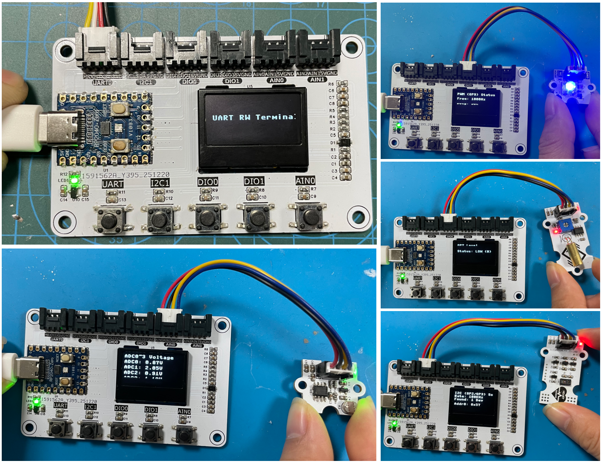
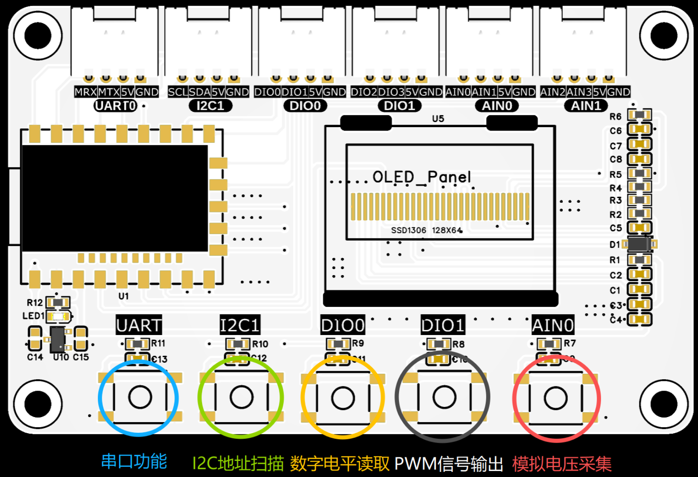
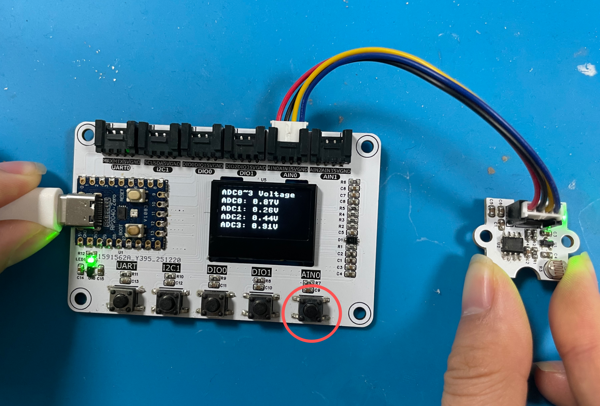
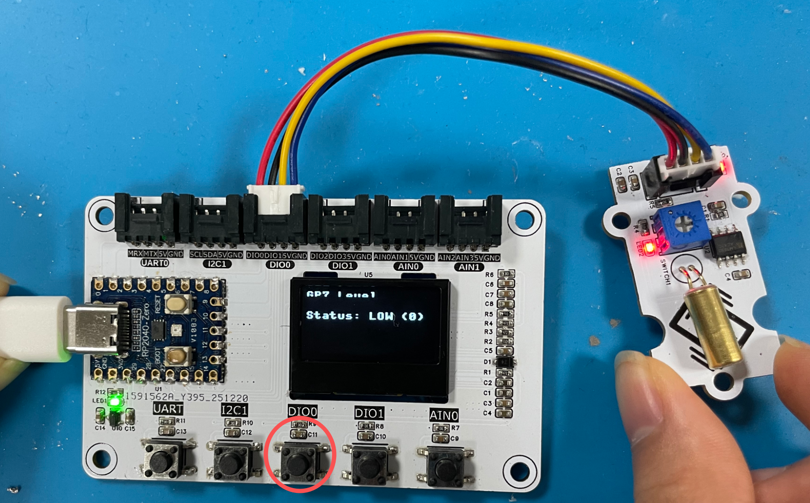
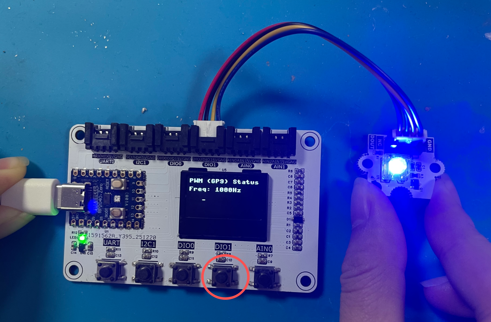
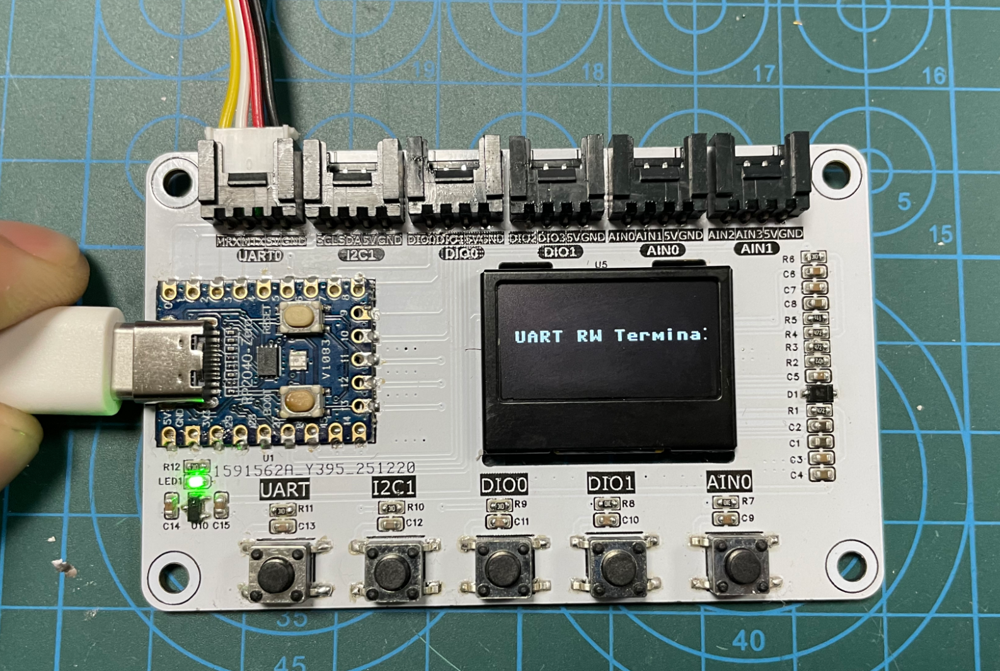
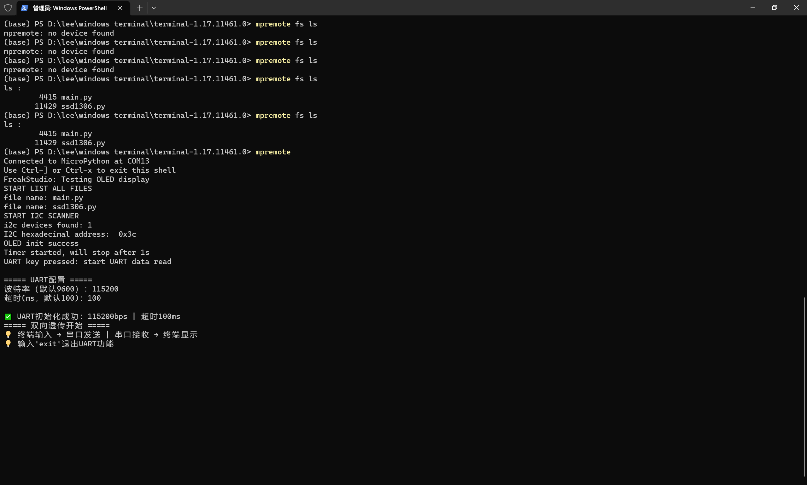
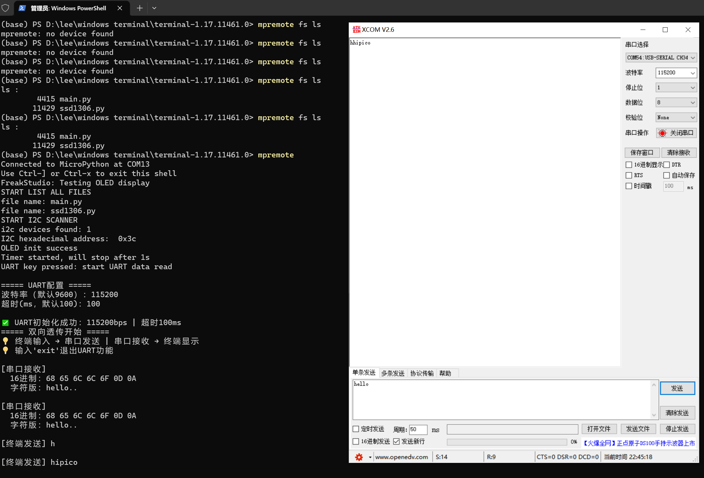

# Graftrove 多接口传感器测试器

# 1.项目介绍

本程序基于 MicroPython v1.23.0 开发，核心目标是快速测试树莓派 Pico（RP2040）上 Grove 接口的各类传感器模块，并通过 SSD1306 I2C 接口 OLED 屏幕（128x64）直观展示测试结果。程序集成了 ADC 电压采集、PWM 信号生成、GPIO 电平读取、I2C 设备扫描、UART 数据接收五大核心功能，可适配绝大多数 Grove 接口传感器的基础测试需求。

# 2. 环境要求

## 2.1 软件环境

- MicroPython 版本：v1.23.0（适配 RP2040 芯片）
- 依赖库：`ssd1306.py`（SSD1306 OLED 驱动库，需与主程序放在同一目录）

## 2.2 硬件环境

- 主控板：树莓派 Pico / Pico W（RP2040 核心）
- 外设：128x64 分辨率 I2C 接口 OLED 屏幕（SSD1306 驱动）
- 按键：5 个独立按键（用于触发不同功能）

# 3.硬件连接说明

# 4.功能说明

## 4.1 初始化动画

程序启动后，OLED 屏幕先显示初始化文字，随后触发文字移动动画：

- "FreakStudio" 文字在屏幕水平移动，5 秒后自动停止并居中显示；

## 4.2 按键触发功能

**需要注意，如果需要切换功能，只能选择重新启动后按下对应功能按键。**

## 4.3 UART 双向透传核心特性

- **终端配置**：支持自定义波特率（1200/2400/4800/9600/19200/38400/115200）、超时时间（10~1000ms），带输入容错；
- **数据显示**：串口接收数据同时输出 16 进制（完整无截断）和字符格式（不可打印字符用 "." 替代）；
- **双向传输**：终端输入内容转发至串口，串口数据实时输出到终端；
- **优雅退出**：输入 'exit' 可退出 UART 功能，自动清理资源并更新 OLED 提示。

# 5.使用方法

## 5.1 准备工作

1. 给树莓派 Pico 烧录 MicroPython v1.23.0 固件（RP2040 版本）；
2. 将 `ssd1306.py` 驱动库和本程序 `main.py` 上传到 Pico 根目录；
3. 按照「硬件连接说明」完成外设和按键的接线。

## 5.2 运行程序

1. 给 Pico 上电，程序自动运行（启动时会延时 3 秒等待设备就绪）；
2. 串口终端可查看调试信息（如 I2C 设备扫描结果、按键触发日志）；
3. 按下对应按键，OLED 屏幕会切换显示对应功能的测试结果；
4. 若需退出程序，在串口终端发送 `Ctrl+C`，屏幕会显示 "Exit Success!"；
5. 需要注意，如果需要切换功能，只能选择重新启动后按下对应功能按键。

## 5.3 不同功能说明

按下 AIN0 按键，读取四个 ADC 通道电压并显示：

按下 DIO0 按键，读取数字电平：

按下 DIO1，输出 PWM 波形：

按下 I2C1，读取 I2C 地址：

按下 UART，此时 OLED 屏幕显示调试信息：

此时，使用 mpremote 工具连接树莓派 Pico，首先设置串口参数：

接着，我们可以读取/写入串口数据：

# 6.代码结构说明

## 6.1 核心模块划分

1. 导入模块：SSD1306 驱动、硬件外设（I2C/Pin/Timer/UART 等）、时间 / 系统库；
2. 全局变量：OLED 地址、动画参数、功能状态标志、外设实例等；
3. 功能函数：

   - 动画相关：update_text_display（文字显示更新）、move_text（定时器回调）；
   - 功能控制：stop_current_func（停止当前功能，保证互斥）；
   - 外设功能：adc_func/pwm_func/gpio_func/i2c_scan_func/uart_func（五大核心功能）；
   - 中断辅助：reset_irq_flag（按键防抖复位）；
4. 中断回调：5 个按键的中断处理函数（仅调度，不执行耗时操作）；
5. 初始化配置：按键中断初始化、I2C/OLED 初始化、动画定时器启动；
6. 主程序：无限循环，捕获 Ctrl+C 实现优雅退出。

## 6.2 关键特性与注意事项

- 中断处理规范：中断回调函数仅做调度，耗时操作（如 OLED 刷新、外设读写）放在主线程执行，避免中断阻塞；
- 按键防抖：通过 irq_flag 标志实现 100ms 防抖，避免按键抖动重复触发；
- 功能互斥：切换功能前会自动停止当前运行的外设功能（如关闭 PWM、释放 UART），防止资源冲突；
- 异常处理：定时器调度、中断处理均包含异常捕获，避免程序崩溃；
- UART 核心优化：

  - 支持自定义波特率 / 超时，适配不同陀螺仪的串口参数；
  - 数据双格式显示（16 进制 + 字符），便于调试陀螺仪二进制数据；
  - 输入容错 + 优雅退出，提升交互体验。
